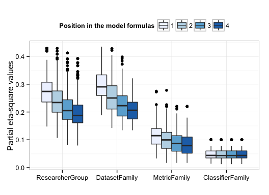

# Replication Package for Comments on ‘Researcher Bias: The Use of Machine Learning in Software Defect Prediction'

Chakkrit Tantithamthavorn, Shane McIntosh, Ahmed E. Hassan, and Kenichi Matsumoto  
[IEEE Transactions on Software Engineering, vol. 42, issue 11, 2016](http://dx.doi.org/10.1109/TSE.2016.2553030)

**Abstract.** Shepperd et. al. find that the reported performance of a defect prediction model shares a strong relationship with the group of researchers who construct the models. In this paper, we perform an alternative investigation of Shepperd et. al.’s data. We observe that (a) researcher group shares a strong association with the dataset and metrics that are used; (b) the strong association among the explanatory variables introduces a large amount of interference when interpreting the impact that researcher group has on model performance; and (c) when we mitigate the interference, researcher group is found to have a smaller impact than metric family has. These observations lead us to conclude that the relationship between researcher groups and the performance of a defect prediction model may have more to do with the tendency of researchers to reuse experimental components (e.g., datasets and metrics). We recommend that researchers experiment with a broader selection of datasets and metrics to combat potential bias in their results.

**Reproducibility.** We provide an access to our experimental data and scripts, which is generated from R markdown using ```knitr``` R package. This means that all the results from our paper can be reproduced with the code and data available online.

```bibtex
@ARTICLE{Tantithamthavorn16,
author={C. Tantithamthavorn and S. McIntosh and A. E. Hassan and K. Matsumoto},
journal={IEEE Transactions on Software Engineering},
title={Comments on #8220;Researcher Bias: The Use of Machine Learning in Software Defect Prediction #8221;},
year={2016},
volume={42},
number={11},
pages={1092-1094},
doi={10.1109/TSE.2016.2553030},
ISSN={0098-5589},
month={Nov},
}
```

## 1) Download dataset and scripts

- Download [misc.R](resources/misc.R) 
- Download [rawdata.csv](resources/rawdata.csv), which is a copy version of https://codefeedback.cs.herts.ac.uk/mlbias/rawdata.csv

## 2) Load miscellaneous functions

```R
source("misc.R")
```

## 3) The Presence of Collinearity

```R
pair <- combn(c("ResearcherGroup","MetricFamily","DatasetFamily","ClassifierFamily"),2)
results <- NULL
for(i in 1:ncol(pair)){
    Xsq <- assocstats(table(data[,pair[1,i]],data[,pair[2,i]]  ))
    
    results <- rbind(results, c(
        "Pair"=paste0(pair[,i],collapse=" = ") ,
        "Cramer's V"=sprintf("%.2f%s",
                             Xsq$cramer,
                             ifelse(Xsq$chisq_tests[2,3] <= 0.05, "***" , "-")
        ),
        "Magnitude"=Cramer(Xsq$cramer)
    )
    )
}
```

### 3.1) Table 1

```R
results[rev(order(results[,"Cramer's V"])),]
```

The output is

```
##      Pair                                 Cramer's V Magnitude          
## [1,] "ResearcherGroup = MetricFamily"     "0.65***"  "Strong"           
## [2,] "ResearcherGroup = DatasetFamily"    "0.56***"  "Relatively strong"
## [3,] "MetricFamily = DatasetFamily"       "0.55***"  "Relatively strong"
## [4,] "ResearcherGroup = ClassifierFamily" "0.54***"  "Relatively strong"
## [5,] "DatasetFamily = ClassifierFamily"   "0.34***"  "Moderate"         
## [6,] "MetricFamily = ClassifierFamily"    "0.21***"  "Moderate"
```

## 4) The Interference of Collinearity

```R
bootstrap_analysis <- function(data, indep, N){
    
    results <- NULL
    for(i in 1:N){
        # generate a bootstramp sample
        indices <- sample(nrow(data),nrow(data),replace=T)     
        
        # permute the ordering of explanatory variables
        for(ordering in permn(1:length(indep)) ){
            predictor <- indep[ordering]
            
            # train a linear regression model using the bootstrap sample
            f <- formula(paste("MCC ~ " , paste(predictor,collapse=" * ")))
            m <- lm(f, data=data[indices,])
            
            # compute the partial eta-square statistic
            eta_results <- etasq(aov(m),partial=T)[,"Partial eta^2"][1:length(indep)]
            names(eta_results) <- predictor
            
            ranking <- 1:4
            names(ranking) <- indep[ordering]
            
            results <- rbind(results, data.frame(
                variable=indep,
                ranking=ranking[indep],
                value=eta_results[indep])
            )
        }  
    }
    rownames(results) <- NULL
    return(data.frame(results))
}

set.seed(1234)
indep <- c("ResearcherGroup","DatasetFamily","MetricFamily","ClassifierFamily") 
results <- bootstrap_analysis(data,indep,1000)
saveRDS(results, file = "bootstrap-analysis.rds")
```

### 4.1) Figure 1

```R
results <- readRDS("bootstrap-analysis.rds")
results$variable <- factor(results$variable, 
                           levels=c("ResearcherGroup","DatasetFamily",
                                    "MetricFamily","ClassifierFamily"))
results$ranking <- factor(results$ranking)

ggplot( results ,aes(x=variable,y=value,fill=ranking )) + geom_boxplot() + theme_bw() +
    xlab("") + ylab("Partial eta-square values")  +
    scale_fill_brewer(palette="Blues")  + theme(legend.position="top") + 
    guides(fill=guide_legend(title="Position in the model formulas"))
```



## 5) Mitigating the Collinearity

### 5.1) Select the Eclipse dataset family

```R
eclipse_data <- data[data$DatasetFamily == "ECLIP",]
eclipse_data$DatasetFamily <- NULL
```

### 5.2) Define two models

```R
indep_1 <-  c("ResearcherGroup","ClassifierFamily")
indep_2 <-  c("MetricFamily","ClassifierFamily")
m1 <- lm(formula(paste("MCC ~" , paste(rev(indep_1),collapse=" * "))), data=eclipse_data)
m2 <- lm(formula(paste("MCC ~" , paste(rev(indep_2),collapse=" * "))), data=eclipse_data)
```

### 5.3) Analyze the ResearcherGroup Model

#### 5.3.1) Redundancy analysis

```R
redun(formula(paste("~ " , paste(indep_1,collapse=" + "))), data=eclipse_data, nk=0)
```

The output is

```
## 
## Redundancy Analysis
## 
## redun(formula = formula(paste("~ ", paste(indep_1, collapse = " + "))), 
##     data = eclipse_data, nk = 0)
## 
## n: 126   p: 2    nk: 0 
## 
## Number of NAs:    0 
## 
## Transformation of target variables forced to be linear
## 
## R-squared cutoff: 0.9    Type: ordinary 
## 
## R^2 with which each variable can be predicted from all other variables:
## 
##  ResearcherGroup ClassifierFamily 
##            0.785            0.785 
## 
## No redundant variables
```

#### 5.3.2) AIC computation

```R
AIC(m1);
```

The output is

```
## [1] -77.20829
```

#### 5.3.3) Adjusted R2 computation

```R
summary(m1)$adj.r.squared
```

The output is

```
## [1] 0.1932176
```

#### 5.3.4) Partial eta-square values computation

```R
etasq(aov(m1))
```

The output is

```
##                                  Partial eta^2
## ClassifierFamily                    0.12237562
## ResearcherGroup                     0.12679423
## ClassifierFamily:ResearcherGroup    0.02177965
## Residuals                                   NA
```

## 5.4) Analyze the MetricFamily Model

### 5.4.1) Redundancy analysis

```R
redun(formula(paste("~ " , paste(indep_2,collapse=" + "))), data=eclipse_data, nk=0)
```

The output is

```
## 
## Redundancy Analysis
## 
## redun(formula = formula(paste("~ ", paste(indep_2, collapse = " + "))), 
##     data = eclipse_data, nk = 0)
## 
## n: 126   p: 2    nk: 0 
## 
## Number of NAs:    0 
## 
## Transformation of target variables forced to be linear
## 
## R-squared cutoff: 0.9    Type: ordinary 
## 
## R^2 with which each variable can be predicted from all other variables:
## 
##     MetricFamily ClassifierFamily 
##            0.279            0.279 
## 
## No redundant variables
```

#### 5.4.2) AIC computation

```R
AIC(m2);
```

The output is

```
## [1] -104.9324
```


#### 5.4.3) Adjusted R2 computation

```R
summary(m2)$adj.r.squared
```

The output is 

```
## [1] 0.3612852
```

#### 5.4.4 Partial eta-square values computation

```R
etasq(aov(m2))
```

The output is

```
##                               Partial eta^2
## ClassifierFamily                  0.1128156
## MetricFamily                      0.2352727
## ClassifierFamily:MetricFamily     0.1625307
## Residuals                                NA
```
